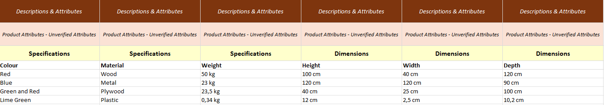

--- 
sidebar_position: 3
---

# Attributes

In this module, we manage **attributes**.  
All attributes are set at the **product level** and represent **tabulated product information**.

---

### Headers
- “Table headers” or **groupings of attributes**.
- Set on the **third row** in the template.
- Several attribute keys can share the same header.
- Sharing the same header means the attribute keys will be grouped in the same table in the platform.  

**Examples:**  
- Technical specifications  
- Design specifications
- Environmental specifications

### Keys
- Attribute **keys** define the corresponding values.
- Set on the **fourth row** in the template.
- All keys must be **unique** across the template.  

**Examples:**  
- Colour  
- Width  
- Material

### Values
- Attribute **values** correspond to their respective keys.
- Values are set in the **grid** for each product, defined by the products and keys.

---

:::note Important Notes
All attributes are **free-text** information — you create your own headers, keys, and values.  
You can create as many attributes as needed; simply fill in columns with your desired header/key/value setup (as shown in the example).
:::

---

## Example

**Header** ("Specifications", "Dimensions") is set on the third row   
**Keys** (i.e. "Colour", "Material") is set on the fourth row   
**Values** is set on each article row

---

## Tips & Tricks / Best Practices

::::caution SQARP GOLD STANDARD
- Include **units** in the values rather than in the keys.  
  _Example:_ `Width: 500 mm` instead of `Width (mm): 500`  
- Keep attribute values **short** — longer text belongs in **description texts**.  
- Ensure **keys and values** are consistent across the entire assortment.  
- Avoid Boolean values like `True` or `False`.

:::tip Improve clarity for boolean attributes
You can improve clarity by rephrasing Boolean-style attributes.  
**Example:** `Has heating: Yes`❌ → `Heating: With heating`✅
:::
::::