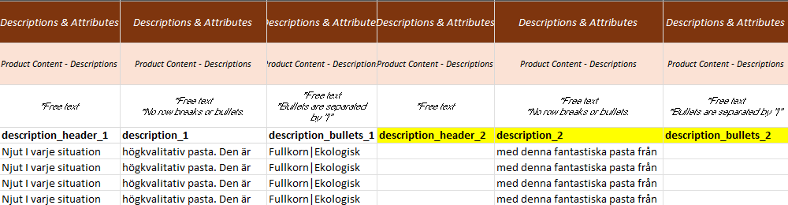

--- 
sidebar_position: 2
---

# Descriptions

Each **description block** consists of:
- A **header**
- A **description**
- **Bullets**

Each block must have content in **either** the description or bullets column — but can also have data in **all** columns.

A product can have:
- No description blocks
- One description block
- Several description blocks

---

## Adding Multiple Description Blocks

To add several description blocks for the same product:
1. Create **additional columns** in the data template.
2. Remember: the **order** of description blocks in the template is the same as in the SQARP platform.
3. For each new block, create **three columns**:
   - `description_header_[number]`
   - `description_[number]`
   - `description_bullets_[number]`
4. Identify the product using its article number.
5. Fill in the header, description, and/or bullets for that block.

---

## Data & Definitions

| Data                          | Definition                                  | Rules & Validation |
|-------------------------------|----------------------------------------------|--------------------|
| `description_header_[number]` | Header for one description block             | Cannot contain HTML, line breaks, or other text formatting. |
| `description_[number]`        | Body of one description block                | Cannot contain HTML, line breaks, or other text formatting. |
| `description_bullets_[number]`| Bullet points for one description block (pipe-separated) | Cannot contain HTML, line breaks, or other text formatting. Use <code>\|</code> as the separator between bullet points. |

> `[number]` = To create more description blocks, create new columns for each block.

---

## Example

To add more description blocks to your articles, create new columns in the template.  
In the example below, the **yellow-marked columns** have been created for additional description blocks.

  <strong>Note:</strong> All three columns must be duplicated together:
  <ul>
    <li><code>description_header_[number]</code></li>
    <li><code>description_[number]</code></li>
    <li><code>description_bullets_[number]</code></li>
  </ul>

