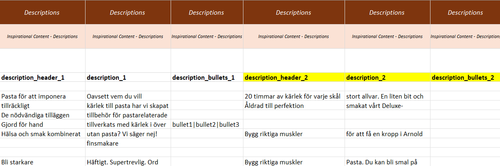

# Brands

To create a new brand, choose the sheet “basic_brands_xx” (where xx will be your chosen language type, i.e “en”) and enrich your brand(s) with content. One row represents one unique brand, several brands can be added in this sheet.

Each product needs to be linked to a brand.

## Data & Definitions​ - “basic_brands_xx”

| Data | Definition | Rules & validation |
|------|------------|--------------------|
| **brand\_name\_slug** | Unique identifier for the brand entity | Mandatory. Can only contain alphanumerical characters and “-“, “_”. Each brand slug must be unique within the organization. |
| **brand\_name** | The public name of the brand entity | Mandatory. Free text |
| **logo\_image\_url** | The URL to the brand logo | Highly recommended |
| **description\_header\_\[number]** | Header to one description block | Cannot contain html, line breaks or other text formatting. |
| **description\_\[number]** | Body of one description block | Cannot contain html, line breaks or other text formatting. |
| **description\_bullets\_\[number]** | Bullet points of one description block (pipe-separated) | Cannot contain html, line breaks or other text formatting. <code>\|</code> is used as separator between bullet points. |
| **image\_url\_\[number]** | URL to one image file | Must be a valid URL to an image file. Validated for 200 response. |
| **document\_url\_\[number]** | URL to one document file | Must be a valid URL to a document file. Validated for 200 response. |
| **document\_type\_\[number]** | Indication of the type of document | Must be valid document type. Choose type from sheet available_units. |
| **document\_language\_codes\_\[number]** | Indication of the document language. | Specify document language in lowercased ISO 639-1 Code. List of languages found in sheet available_units, in field 'language_code'. If several languages, separate with <code>\|</code> |
| **video\_url\_\[number]** | URL to one externally hosted video | Must be a valid URL to a video. Preferably YouTube or Vimeo. Validated for 200 response. |
| **video\_type\_\[number]** | Indication of the type of video | Must be a valid video type. Choose video type from from sheet available_units |
| **video\_language\_codes\_\[number]** | Indication of the spoken video language | Specify document language in lowercased ISO 639-1 Code. List of languages found in sheet available_units, in field 'language_code'. If several languages, separate with <code>\|</code> |

`[number]` = To create more description blocks, images, documents and videos - create new columns for each block.

---

## Adding More Content Blocks

To add more content blocks to your brand, create **new columns** in the template.  
In the example below, the yellow-marked columns have been created for additional description blocks.

**Important:** When duplicating description content, **all three columns** must be added together:
- `description_header_[number]`
- `description_[number]`
- `description_bullets_[number]`

The same rule applies to **documents** and **videos** (i.e., duplicate the full set of related columns with the incremented `[number]`).
