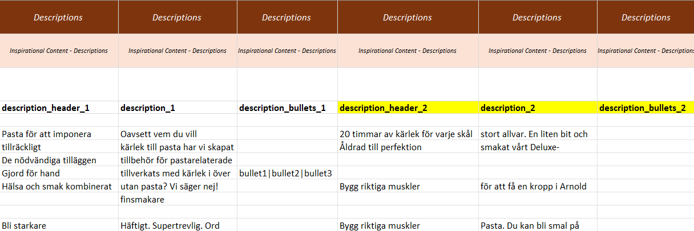

# Series & USPs

To create a **Series** or a **USP**, open the sheet `basic_inspirationals_xx` (replace `xx` with your language code, e.g., `en`) and enrich your inspirational(s) with content.  
Each **row** represents one unique series or USP. You can add multiple series/USPs in this sheet.

After creating your Series and/or USPs, connect your articles to their respective inspirational entities. You will find the relevant columns in the `basic_product_template` for Series and USPs.

:::tip Slugs
Create a **slug** for each inspirational entity.  
A slug must be **lowercase**, contain **no special characters**, and use underscores (`_`) instead of spaces.
:::

---

## Data & Definitions — `basic_inspirationals_xx`

| Data                           | Definition                                               | Rules & validation |
|--------------------------------|----------------------------------------------------------|--------------------|
| **inspirational\_slug**           | Unique identifier for the brand entity                   | **Mandatory.** Alphanumerical plus `-`, `_`. Each inspirational slug must be unique within the brand. |
| **inspirational\_name**           | Public name of the inspirational entity                  | **Mandatory.** Free text. |
| **inspirational\_type**           | Type of inspirational                                    | **Mandatory.** Allowed values: `series` or `usp` (lowercase). |
| **brand\_name\_slug**             | Unique identifier for the brand entity connected to the inspirational entity | **Mandatory.** Alphanumerical plus `-`, `_`. Each brand slug must be unique within the organization. |
| **description\_header\_\[number]**  | Header for one description block                         | Cannot contain HTML, line breaks, or other formatting. |
| **description\_\[number]**         | Body text for one description block                      | Cannot contain HTML, line breaks, or other formatting. |
| **description\_bullets\_\[number]** | Bullet points (pipe-separated) for one description block | Cannot contain HTML, line breaks, or other formatting. Use <code>\|</code> as the separator between bullet points. |
| **image\_url\_\[number]**           | URL to one image file                                    | Must be a valid image URL. Validated for HTTP 200 response. |
| **document\_url\_\[number]**        | URL to one document file                                 | Must be a valid document URL. Validated for HTTP 200 response. |
| **document\_type\_\[number]**       | Type of document                                         | Must be a valid document type. Choose from reference sheet `Document Types`. |
| **document\_language\_codes\_\[number]** | Language(s) of the document                           | Specify lowercased **ISO 639-1** codes. Full list in reference sheet `Languages`. Separate multiple languages with <code>\|</code>. |
| **video\_url\_\[number]**           | URL to one externally hosted video                       | Must be a valid video URL (preferably YouTube or Vimeo). Validated for HTTP 200 response. |
| **video\_type\_\[number]**          | Type of video                                            | Must be a valid video type. Choose from reference sheet `Video Types`. |
| **video\_language\_codes\_\[number]** | Spoken language(s) of the video                         | Specify lowercased **ISO 639-1** codes. Full list in reference sheet `Languages`. Separate multiple languages with <code>\|</code>. |

> `[number]` = To create more description blocks, images, documents, and videos, create **new columns** with incremented suffixes (e.g., `_1`, `_2`, `_3`, …).

---

## Adding More Content Blocks

To add more content blocks to your brand, create **new columns** in the template.  
In the example below, the yellow-marked columns have been created for additional description blocks.

**Important:** When duplicating description content, **all three columns** must be added together:
- `description_header_[number]`
- `description_[number]`
- `description_bullets_[number]`

The same rule applies to **documents** and **videos** (i.e., duplicate the full set of related columns with the incremented `[number]`).
