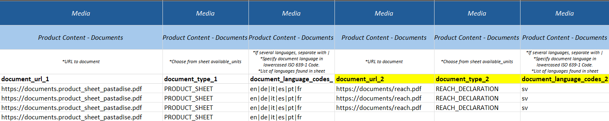

# Documents

## Data

| Field                     | Definition                         | Rules & Validation |
|---------------------------|-------------------------------------|--------------------|
| `document_url`            | URL to one document file.           | Must be a valid URL to a document file. Validated for **200 response**. |
| `document_type`           | Indication of the type of document. | Must be a valid document type. Find document types in reference sheet `Document Types`. |
| `document_language_codes` | Indication of the document language.| Lowercased **ISO 639-1 Code**. Find codes in reference sheet `Languages`. |

---

## Adding Documents

- The URL must be a path to a document file.
- Each product can have none, one, or several documents.

To add more documents:
1. Create **new columns** in the template.  
2. See the example below — the **yellow-marked columns** have been created for additional documents.

---

:::warning Important Note
All three columns must be duplicated together:
- `document_url`
- `document_type`
- `document_language_codes`
:::
