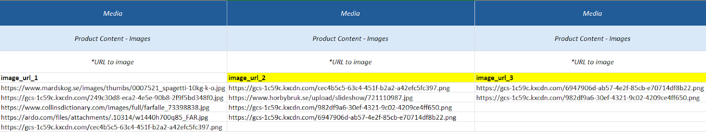

# Images

## Data

| Field      | Definition                | Rules & Validation |
|------------|---------------------------|--------------------|
| `image_url` | URL to one image file.     | Must be a valid URL to an image file. Validated for **200 response**. |

---

## Adding More Images

To add more images to an article:
1. Create **new columns** in the template.
2. See the example below — the **yellow-marked columns** have been created for additional images.

---

## Tips & Tricks / Best Practices

::::caution SQARP GOLD STANDARD
- Use **unique images** for each individual product.
- Use a **background-removed image** as the first image.
