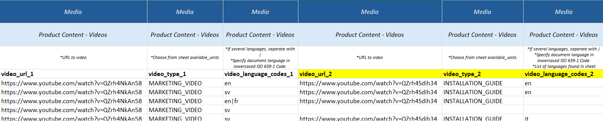

# Videos

## Data

| Field                 | Definition                         | Rules & Validation |
|-----------------------|-------------------------------------|--------------------|
| `video_url`           | URL to one externally hosted video. | Must be a valid URL to a video. Preferably YouTube or Vimeo. Validated for **200 response**. |
| `video_type`          | Indication of the type of video.    | Must be a valid video type. Find video types in sheet `available_units`. |
| `video_language_code` | Indication of the spoken video language. | Lowercased **ISO 639-1 Code**. Find codes in sheet `available_units`. |

---

## Adding Videos

- The URL must be a path to an externally hosted video (e.g., YouTube, Vimeo).  
- Each product can have none, one, or several videos.

To add more videos:
1. Create **new columns** in the template.  
2. See the example below — the **yellow-marked columns** have been created for additional videos.

---

:::warning Important Note
All three columns must be duplicated together:
- `video_url`
- `video_type`
- `video_language_codes`
:::

