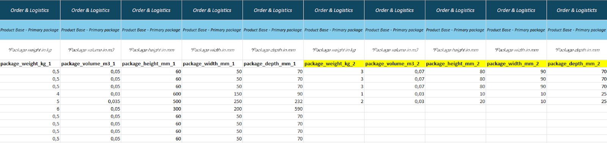

# Primary Package

In this module, package information for your **primary package** is added to your products.  
One product can have several packages/parcels.

---

## Data & Definitions

| **Data**              | **Definition**                                                      | **Rules & Validation** |
|-----------------------|----------------------------------------------------------------------|-------------------------|
| **packaging_type**    | Packaging type of the primary package, i.e. box, pallet, container or bundle. | Must be a valid packaging type. Choose type from reference sheet `Package Types`. |
| **packaging_material**| The material of the primary package.                                 | Free text |
| **gtin14**            | GTIN14-code of the primary package.                                  | Must be 14 digits and unique for all articles. |
| **package_weight_kg** | The weight of the package in kilograms.                              | Must be numerical |
| **package_volume_m3** | The volume of the package in cubic meters.                           | Must be numerical |
| **package_height_mm** | The height of the package in millimetres.                            | Must be numerical |
| **package_width_mm**  | The width of the package in millimetres.                             | Must be numerical |
| **package_depth_mm**  | The depth of the package in millimetres.                             | Must be numerical |

---

## Additional Notes

Each packaging column in the template represents a dimension value for a package.  
To add multiple packages to one product, include the product on multiple rows in the template — each row represents a package dimension and can have different data.

---

