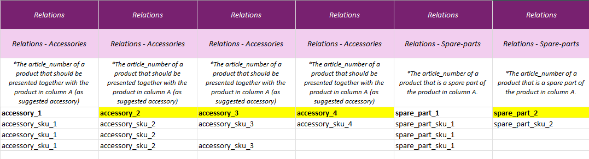

# Accessories & Spare Parts

## Overview

In SQARP, **Accessories** and **Spare Parts** define compatibility relationships between products.

---

## Accessories

Products that are **recommended** with the main product (listed in column A),  
but the accessory is a **standalone** product that can be purchased separately.

---

## Spare Parts

Products classified as **components** of the main product (listed in column A).

:::info[Important]
- Customers can use this relationship to find parts for a product they already own.  
- Spare parts are always **separate products** that can be purchased on their own.
:::

**Example:**  
Bicycle chain – if your bike chain breaks, you may want to buy a new chain.

---

## Adding More Related Articles

To add more related articles to the main article:
1. Create **new columns** in the template.  
2. See the example below — the **yellow-marked columns** have been created for additional related articles.

  <strong>Note:</strong> Only the products included in the template will be affected by the change upon upload.

