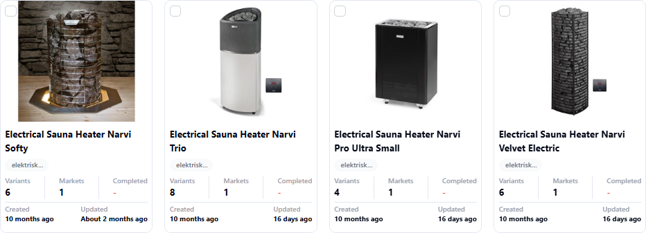
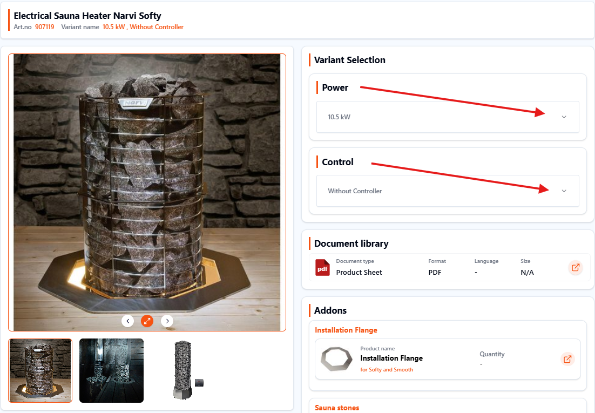

# Overview

In this module we set the product titles and create a **variant management structure** for the products, grouping articles that belong together into virtuals. Basic information is added to the virtuals, and products are connected to virtuals.

---

## Data & Definitions

| **Data**                  | **Definition**                                                                                              | **Rules & Validation** |
|---------------------------|--------------------------------------------------------------------------------------------------------------|-------------------------|
| **virtual_reference**     | Unique reference for the virtual.                                                                            | Can only contain alphanumerical characters and `-`, `_`. Each internal reference must be unique within the organization. Mandatory for every virtual. |
| **product_type**          | A string indicating the type of product (or category) included in the virtual. Used in the product title.    | Must be the same for all rows with the same `virtual_reference`. Mandatory for every virtual. |
| **virtual_name**          | A string indicating the specific features and differentiation for the virtual.                               | Must be the same for all rows with the same `virtual_reference`. |
| `selectable_key_[number]` | The header for the selectable key with index `[number]`.                                                    | Should only be used if virtual contains more than one product. Must be the same for all rows with the same `virtual_reference`. Keys with different index numbers within the same virtual must be unique. |
| `selectable_value_[number]` | The selectable value for the particular product relating to the key with index `[number]`.                 | Should only be used if virtual contains more than one product. The combination of selectable values across all indices must be unique for every product within a virtual. |

---

## Context in the Entire Process

This module builds the foundational structure for **variants** and **main articles**.

The goal is to create a **variant management structure** across the entire assortment with main articles and selectable attributes to help customers navigate the assortment.  
This means all variants of a product are gathered on a single product page, allowing the customer to navigate and choose between the different variants directly on this page.

**Example:** If a shirt is available in several colors and sizes, all these options will be displayed on the same page, and the customer should easily be able to choose their preferred color and size.

The structure created with variants and main articles is later used to place media and descriptions at the two different abstraction levels.

---

## What Data Is Included in This Module

The entire variant management module is **language-specific**; the following data applies per language:

- Link to the main article that ties together variants of the same product
- Product type
- Main article name / virtual reference
- Selectable attributes

---

## Why This Module Is Important

### Helps Customers Navigate the Assortment More Efficiently
- Dividing the assortment into main articles and variants makes navigation faster and more organized.  
- In an assortment with 1000 articles divided into main articles with 5 variants each, customers can find a relevant product **5× faster**.

---

### Helps the Customer See the Context for a Product
- 50–90% of e-commerce traffic lands directly on a product page.  
- Showing the **full context** of a product variant means also displaying corresponding products in other versions.

- If listed as single products, customers must work harder to discover other versions — potentially requiring 5–10 extra clicks.

- When variants are grouped, the customer can immediately see all available versions and navigate in just a few clicks:

---

### Better Traffic Driving / SEO
- Hierarchical landing pages are more relevant for customers arriving from search engines.  
- Main article pages tend to rank better than individual product pages.

---

### Helps Customers Understand Similarities/Differences
- A well-built variant management structure clarifies differences between products in an assortment.  
- Hierarchical naming helps users and improves SEO by ensuring unique, keyword-rich titles.

---

## Tips & Tricks / Best Practice

:::caution SQARP GOLD STANDARD — Virtual Reference
The **virtual reference** (main article number) ties similar variants together into a virtual.  
Use a recognizable format:  
`[BRAND]-[PRODUCT_TYPE]-[VIRTUAL_NAME]`  
Example: `SQARP-LAWNMOWER-SE400`  
It’s common to use **uppercase** and **hyphens**.
:::

---

### Variant Grouping
- Avoid grouping products that look very different visually.  
- Avoid grouping products with large differences in price or technical specs.  
- Smaller assortments → group less frequently into smaller virtual groups.  
- Larger assortments → group more frequently into bigger virtual groups.

---

### Product Type
- Must be relevant for all products in the variant and specific enough to be clear.  
- Keep consistent naming across the brand.  
- Reflect consumer search behavior — product types are used in titles and impact search rankings.  
- Avoid including attributes (color, size, material) in the product type.  

**Style Guide for Product Types:**
- Capitalize important words; lowercase for “for,” “with,” “in.”  
- Keep concise; only exceed 25 characters when necessary.

---

### Virtual Names
- Should consistently distinguish variants within the same product type.  
- Include important keywords for search relevance.  

**Style Guide for Variant Names:**
- Standard characters only.  
- Capitalize important words; lowercase for “for,” “with,” “in.”  
- Include units (`100 cm` not `100`).  
- Do not include the brand.  
- Use “.” for decimals, avoid commas.

---

### Selectable Attributes (Key/Value)
- Keep attribute keys and values consistent.  
- Avoid incomplete selections.  
- Limit the number of selection options to reduce complexity.  
- Ensure values stand alone (`100 mm` not `100`).  

**Style Guide for Selectable Attributes:**
- Put the most relevant attribute first.  
- Use `/` for multiple text values.  
- Use `x` for multiple measurements in the same unit.  
- Don’t start attribute values with lowercase letters.  
- Use spaces between numbers and units.

---

### Product Title
- **Variant Title Rule:** Product Type + Brand + Variant Name must be unique in the assortment.  
- **Product Name Rule:** Product Type + Brand + Variant Name + Selectable Values must be unique in the assortment.

---

## Q&A

  
<strong>Q1: Why does grouping product variants into a virtual matter?</strong>

It lets customers view all related options (e.g., size or color) on one page, making comparison faster and reducing click fatigue.

  
<strong>Q2: How does variant management improve searchability?</strong>

Consistent, descriptive product types and variant names improve both internal search and SEO.

  
<strong>Q3: What are selectable attributes and why do they matter?</strong>

Attributes like “Color” or “Size” let customers filter quickly; clear values avoid confusion and guide selection.

  
<strong>Q4: How does this structure help when landing on a product page?</strong>

It shows related variants in context so customers can find the right version without restarting their search.

